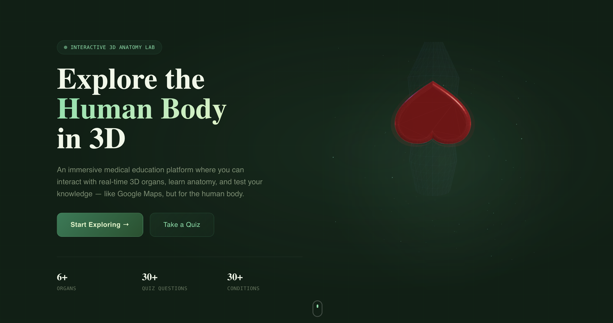

# AnatomyWorld3D 🧬

> **Interactive 3D Human Anatomy Platform for Medical Education**

AnatomyWorld3D is a full-stack medical education web application that lets you explore the human body in 3D. Built for MBBS students, surgical trainees, and anatomy enthusiasts, it features procedurally generated organ models with real-time animations, a comprehensive quiz engine, AI-powered clinical insights, and a personalized progress dashboard.



---

## ✨ Features

- **🫀 14 Procedural 3D Organ Models** — Heart (beating), Lungs (breathing), Brain, Liver, Kidneys, Spleen, Stomach, Pancreas, Intestines, Bladder, Esophagus, Ribcage, Spinal Column & Full Vascular System — all with anatomically accurate geometry
- **🔬 MBBS-Level Clinical Data** — Blood supply, innervation, surgical notes, and common diseases for every organ
- **🤖 AI Clinical Insights** — Powered by Bytez.js + OpenAI, ask for a surgeon's deep-dive on any organ on demand
- **📝 Medical Quiz Engine** — 30+ quiz questions grouped by organ system with explanations
- **📓 Smart Notes** — Personal notes per organ, synced to Supabase
- **📊 Progress Dashboard** — Tracks organs studied, quizzes completed, and note-taking activity linked to your user account
- **🔐 Supabase Auth** — Email/password sign up & sign in with automatic redirection post-login
- **👁️ Layer Visibility Control** — Toggle Skeleton, Organs, Vascular System, and Outline layers independently in the 3D scene

---

## 🛠️ Tech Stack

| Category | Technology |
|---|---|
| **Framework** | Next.js 14 (App Router) |
| **Language** | TypeScript |
| **3D Engine** | React Three Fiber + Three.js + @react-three/drei |
| **Animations** | Framer Motion |
| **Styling** | Tailwind CSS (custom design tokens) |
| **State** | Zustand |
| **Database/Auth** | Supabase (PostgreSQL + Supabase Auth) |
| **AI** | Bytez.js → OpenAI |
| **Fonts** | Playfair Display, DM Sans, JetBrains Mono |

---

## 📁 Project Structure

```
AnatomyWorld3D/
├── public/
│   └── image.png                    # App preview thumbnail
│
├── src/
│   ├── app/                         # Next.js App Router pages & routes
│   │   ├── layout.tsx               # Root layout (fonts, header, metadata)
│   │   ├── page.tsx                 # Landing page (hero, features, CTA)
│   │   ├── globals.css              # Global styles & Tailwind design tokens
│   │   │
│   │   ├── explore/                 # 3D Anatomy Lab
│   │   │   └── page.tsx             # Full-screen 3D viewer + sidebar + info panel
│   │   │
│   │   ├── quiz/                    # Quiz Engine
│   │   │   └── page.tsx             # Quiz interface with organ-system filters
│   │   │
│   │   ├── notes/                   # Personal Notes
│   │   │   └── page.tsx             # Per-organ note editor (Supabase-backed)
│   │   │
│   │   ├── dashboard/               # User Dashboard
│   │   │   └── page.tsx             # Progress stats, recent activity, study heatmap
│   │   │
│   │   ├── organ/[slug]/            # Dynamic organ detail pages
│   │   │   └── page.tsx             # Dedicated full page per organ
│   │   │
│   │   ├── account/                 # Account settings
│   │   │   └── page.tsx
│   │   │
│   │   ├── auth/                    # Authentication flows
│   │   │   ├── login/page.tsx
│   │   │   ├── signup/page.tsx
│   │   │   └── callback/route.ts    # Supabase OAuth callback handler
│   │   │
│   │   └── actions/                 # Next.js Server Actions
│   │       ├── auth.ts              # Login, signup, logout actions
│   │       ├── ai.ts                # Bytez.js / OpenAI organ insight fetcher
│   │       └── progress.ts          # Dashboard progress tracking actions
│   │
│   ├── components/
│   │   ├── layout/
│   │   │   └── Header.tsx           # Global navigation bar (auth-aware)
│   │   │
│   │   ├── three/                   # All 3D / React Three Fiber components
│   │   │   ├── HumanBodyScene.tsx   # Main scene: renders all organ layers
│   │   │   ├── OrganViewer.tsx      # Isolated single-organ viewer
│   │   │   ├── effects/             # Post-processing visual effects
│   │   │   └── organs/              # Individual organ 3D models (16 models)
│   │   │       ├── HeartModel.tsx
│   │   │       ├── LungsModel.tsx
│   │   │       ├── BrainModel.tsx
│   │   │       ├── LiverModel.tsx
│   │   │       ├── KidneyModel.tsx
│   │   │       ├── SpleenModel.tsx
│   │   │       ├── StomachModel.tsx
│   │   │       ├── PancreasModel.tsx
│   │   │       ├── IntestinesModel.tsx
│   │   │       ├── BladderModel.tsx
│   │   │       ├── EsophagusModel.tsx
│   │   │       ├── DiaphragmModel.tsx
│   │   │       ├── RibcageModel.tsx
│   │   │       ├── SpineModel.tsx
│   │   │       ├── VascularSystemModel.tsx
│   │   │       └── BodyOutlineModel.tsx
│   │   │
│   │   └── ui/                      # UI overlay components
│   │       ├── OrganInfoPanel.tsx   # Right-side info panel (facts, AI, clinical data)
│   │       ├── OrganSidebar.tsx     # Left sidebar organ list & search
│   │       └── QuizCard.tsx         # Individual quiz card component
│   │
│   └── lib/
│       ├── data/
│       │   ├── organs.ts            # Complete organ data (14 organs, MBBS-level)
│       │   └── quizzes.ts           # 30+ quiz questions with explanations
│       │
│       ├── store/
│       │   └── useAppStore.ts       # Zustand global state (selected organ, camera, UI)
│       │
│       └── supabase/
│           ├── client.ts            # Supabase browser client
│           └── server.ts            # Supabase server client (SSR-safe)
│
├── .env.local                       # Environment variables (not committed)
├── next.config.ts
├── tailwind.config.ts
└── tsconfig.json
```

---

## 🚀 Getting Started

### Prerequisites
- Node.js 18+
- A [Supabase](https://supabase.com) project (free tier works)
- A [Bytez.js](https://bytez.com) API key for AI features

### 1. Clone the repository

```bash
git clone https://github.com/sumitkumarraju/AnatomyWorld3D.git
cd AnatomyWorld3D
```

### 2. Install dependencies

```bash
npm install
```

### 3. Set up environment variables

Create a `.env.local` file in the root directory:

```env
# Supabase
NEXT_PUBLIC_SUPABASE_URL=your_supabase_project_url
NEXT_PUBLIC_SUPABASE_ANON_KEY=your_supabase_anon_key

# Bytez.js / OpenAI (for AI clinical insights)
BYTEZ_API_KEY=your_bytez_api_key
```

### 4. Set up Supabase Database

Run the following SQL in your Supabase SQL editor to create the progress tracking table:

```sql
create table public.user_progress (
  id uuid default gen_random_uuid() primary key,
  user_id uuid references auth.users(id) on delete cascade,
  organ_slug text not null,
  studied_at timestamptz default now(),
  quiz_score integer,
  notes text,
  unique(user_id, organ_slug)
);

alter table public.user_progress enable row level security;

create policy "Users can manage their own progress"
  on public.user_progress
  for all using (auth.uid() = user_id);
```

### 5. Run the development server

```bash
npm run dev
```

Open [http://localhost:3000](http://localhost:3000) to see the app.

---

## 📸 Pages Overview

| Route | Description |
|---|---|
| `/` | Landing page with 3D preview, features, and CTA |
| `/explore` | Full 3D anatomy lab with layered body view |
| `/explore?organ=heart` | Deep-links into a specific organ |
| `/quiz` | Quiz engine — filter by organ system |
| `/notes` | Write and save personal organ notes |
| `/dashboard` | Progress stats, heatmap, recent activity |
| `/auth/login` | Sign in with email/password |
| `/auth/signup` | Create a new account |

---

## 🧠 Data Model: Organs

Each organ in `src/lib/data/organs.ts` follows this structure:

```ts
{
  slug: 'heart',
  name: 'Heart',
  system: 'Cardiovascular',
  position: [0, 0.2, 0.1],         // 3D scene position
  color: '#dc2626',
  description: '...',               // Full anatomical description
  weight: '250-350g',
  size: '12 × 9 × 6 cm',
  functions: ['...'],
  diseases: ['...'],
  bloodSupply: 'Right and left coronary arteries...',
  innervation: 'Cardiac plexus (vagus + sympathetic T1-T5)',
  surgicalNotes: 'CABG, valve replacement via median sternotomy...',
}
```

---

## 🔒 Authentication Flow

1. User signs up at `/auth/signup` → Supabase creates account → auto-redirected to `/dashboard`
2. User signs in at `/auth/login` → auto-redirected to `/dashboard`
3. Supabase session is managed via `@supabase/ssr` cookies (server + browser safe)
4. Protected routes check session server-side and redirect to `/auth/login` if unauthenticated

---

## 🤖 AI Clinical Insights

The `OrganInfoPanel` includes a **"Surgeon's Deep Dive"** button that calls a Next.js Server Action (`/src/app/actions/ai.ts`). This action uses `bytez.js` to call OpenAI's GPT model with a structured prompt requesting clinical anatomy details, surgical approaches, and pharmacological notes for the selected organ.

---

## 🎨 Design System

The design uses a custom dark-mode palette defined as Tailwind CSS variables in `globals.css`:

| Token | Color | Usage |
|---|---|---|
| `--obsidian` | `#0a0f0d` | Background |
| `--forest-jade` | `#1c7c54` | Primary brand |
| `--mint-bloom` | `#73e2a7` | Accent / highlights |
| `--soft-pistachio` | `#b8d8c7` | Muted text |
| `--cream-white` | `#f4f4f0` | Primary text |

---

## 📄 License

MIT © 2026 [Sumit Kumar Raju](https://github.com/sumitkumarraju)
